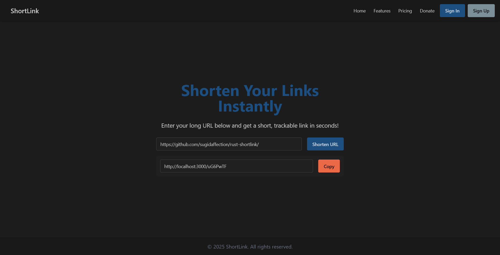

# Rust Shortlink




## Table of Contents

- [About](#about)
- [Getting Started](#getting_started)

## About <a name = "about"></a>

A simple url shortener web application. Save and manage your long url.

## Getting Started <a name = "getting_started"></a>

These instructions will get you a copy of the project up and running on your local machine for development and testing purposes.

### Prerequisites

What things you need to install the software and how to install them:

```
postgresql ^=14
rust ^=1.58
cargo-leptos
```

Additionally, if you are using a Linux-based system, you need to install libpq-dev for PostgreSQL support:

```
sudo apt update
sudo apt install libpq-dev
```

Install cargo-leptos:

```
cargo install cargo-leptos
```

### Installing

Clone the repository and install dependencies:

```
git clone <repository-url>
cd rust-shortlink
```

### Run Server

First, setup your environment:

```
cp .env.example .env
# Edit .env with your database settings
```

For development with hot-reload:

```
cargo leptos watch
```

For production build:

```
cargo leptos build --release
```

The server will start at `http://localhost:3000` by default.
