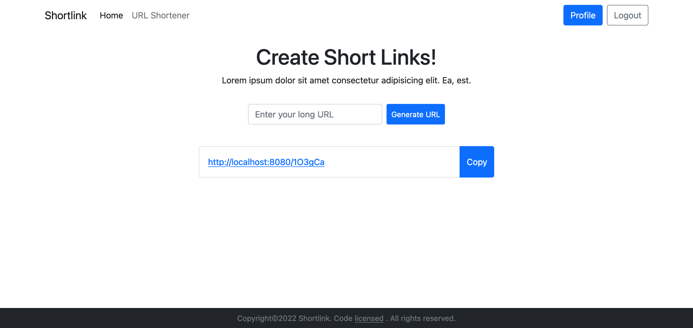
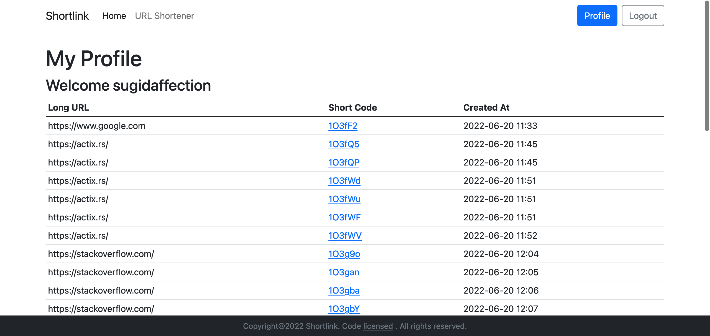

# Rust Shortlink


||
|-|
||

## Table of Contents

- [About](#about)
- [Getting Started](#getting_started)

## About <a name = "about"></a>

A simple url shortener web application. Save and manage your long url.

## Getting Started <a name = "getting_started"></a>

These instructions will get you a copy of the project up and running on your local machine for development and testing purposes.

### Prerequisites

What things you need to install the software and how to install them.

```
postgresql ^=14
rust ^=1.58
```

### Installing

type this command in terminal:
```
./build.sh
```

### Run Server
First thing to do is: 
```
setup .env file
```

then type this command in terminal:
```
cargo run --release
```